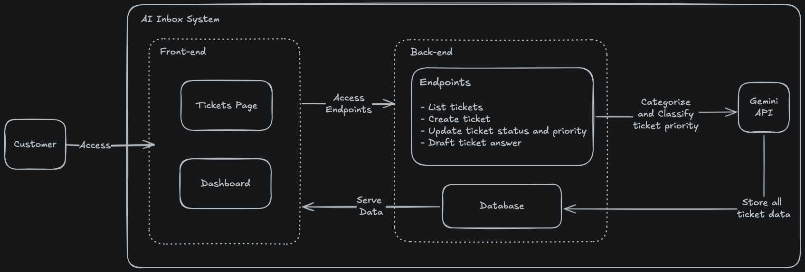

# LLM Email Sorter

**Version:** `v1.0.0`

LLM Email Sorter is an AI-Augmented Inbox support ticket management system built as a monorepo. It leverages Meta Spark 1.1 (Large Language Model) to automatically classify support tickets and provide drafted responses to customer inquiries.

## Monorepo Briefing

This project is structured as a monorepo containing both the frontend and backend applications. This architecture ensures a unified development experience while keeping the client and server concerns cleanly separated.

## Architecture



## Project Structure

```text
.
├── backend/             # FastAPI backend application
├── frontend/            # Next.js frontend application
├── docker-compose.yml   # Docker orchestration
├── AGENTS.md            # Project rules and context
├── README.md            # Root documentation
└── project-diagram.png  # Architecture diagram
```

The project follows a modular architecture designed for scalability and maintainability:

*   / (Root): Contains global configuration and orchestration files, including docker-compose.yml.
*   /frontend: A Next.js (App Router) application utilizing TypeScript, TailwindCSS, and Recharts for data visualization.
*   /backend: A FastAPI (Python) application responsible for the core business logic and API endpoints.
*   /backend/services/ai: A dedicated layer for integration with the AI service (Meta Spark 1.1), handling ticket classification and response drafting.
*   /backend/database: Contains the SQLite persistence layer and SQLAlchemy models.

## AI Integration

This project uses Meta Spark 1.1 for intelligent ticket processing.

*   **Model:** `muse-spark-1.1`
*   **Capabilities:** Automatic ticket classification, priority suggestion, and AI-powered response drafting.
*   **Integration:** Via `backend/services/ai/spark.py` using `openai` SDK (`base_url="https://api.meta.ai/v1"`, `api_key=MODEL_API_KEY`) with `MODEL_API_KEY` (also accepts `SPARK_API_KEY` / `META_SPARK_API_KEY` / `LLM_API_KEY`) from `.env.development` at `https://api.meta.ai/v1` (`Authorization: Bearer $MODEL_API_KEY`).

## Prerequisites

Before running the project, ensure you have the following installed:

*   Docker and Docker Compose
*   A Meta Spark 1.1 API Key

## Getting Started

Follow these steps to run the project locally:

1.  Clone the repository to your local machine.
2.  Create a `.env.development` file in the root directory of the project.
3.  Add your Meta Spark 1.1 API key to the `.env.development` file as follows:
    ```
    MODEL_API_KEY=your_api_key_here
    ```
    The key is sent as `Authorization: Bearer $MODEL_API_KEY` to `https://api.meta.ai/v1`.
4.  Execute the following command to start both the frontend and backend services:
    ```bash
    docker-compose up
    ```
5.  Access the application at http://localhost:3000.

## API Documentation

The backend API is served at http://localhost:8000 and provides the following endpoints:

### List All Tickets
*   Endpoint: GET /tickets
*   Input: None
*   Output: A JSON list of ticket objects.

### Create Support Ticket
*   Endpoint: POST /tickets
*   Input: 
    ```json
    {
      "customer_name": "string",
      "message": "string"
    }
    ```
*   Output: The created ticket object, including AI-generated category and priority.

### Update Support Ticket
*   Endpoint: PATCH /tickets/{id}
*   Input:
    ```json
    {
      "status": "string (optional: 'pending' or 'resolved')",
      "priority": "string (optional: 'low' or 'high')"
    }
    ```
*   Output: The updated ticket object.

### Draft AI Answer
*   Endpoint: POST /tickets/{id}/draft
*   Input: None
*   Output:
    ```json
    {
      "draft": "string"
    }
    ```

## Database and Models

The project uses SQLite for file-based persistence, managed via SQLAlchemy. The primary data model is the Ticket:

*   id: Integer (Primary Key)
*   customer_name: String
*   message: String
*   status: String (Defaults to 'pending')
*   priority: String (Defaults to 'low')
*   category: String (Assigned by AI)
*   created_at: DateTime (UTC)

## Testing Layer

The project maintains a comprehensive testing layer for both environments:

*   Backend: Uses pytest and pytest-asyncio for unit and integration tests. AI services are mocked during API tests to ensure speed and reliability.
*   Frontend: Uses Jest and React Testing Library to validate UI components and user interactions.

## TypeScript Strategy

This project enforces a strict "no any" type strategy to ensure maximum code quality and type safety. This is enforced through two primary mechanisms:

1.  TypeScript Configuration: The noImplicitAny: true setting is enabled in tsconfig.json, preventing the compiler from inferring the any type.
2.  ESLint Enforcement: The @typescript-eslint/no-explicit-any: error rule is active, causing the linter to fail if an explicit any is used in the codebase.

